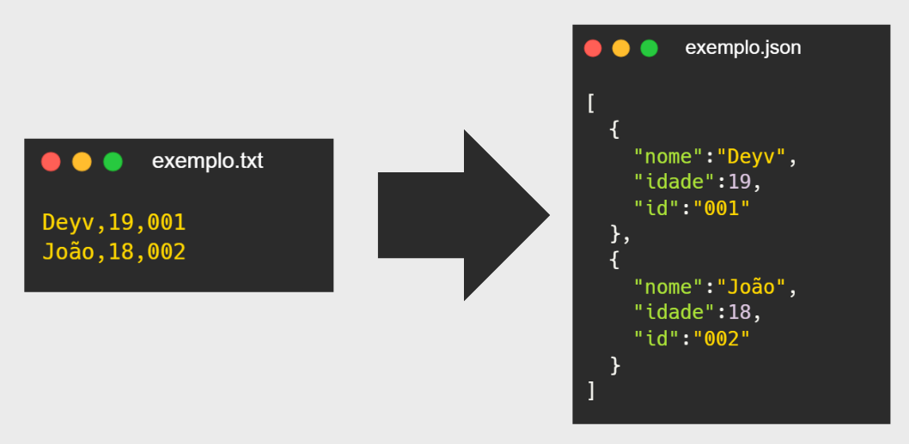

# ⭐JSON_CONVERSOR
    O JSON_CONVERSOR é um projeto que tem como objetivo formular arquivos `.json` , arquivos 
    muito muito úteis no backend para acessar e distribuir dados , de uma maneira simples . 
    Quando um arquivo `.txt` com a formatação requerida é aplicado no programa , um arquivo 
    `.json` é criado , e cada informação do `.txt` é adicionado a um objeto anônimo.

## ⚒️ Tecnologias utilizadas
- Sveltekit
- Typescript
- Git

## 🕹️ Funcionalidades principais
- Captura exclusivamente arquivos .txt para a conversão
- Torna disponível a opção de baixar o arquivo .json apenas quando a conversão é feita
- responsividade para telas pequenas e grandes

## 📥 Como rodar localmente 
clonagem :\
    git clone https://github.com/Devs097518/json_conversor.git
    
instalando dependências :\
    cd json_conversor\
    npm install   

executar :\
    npm run dev 

## 🛰️ Deploy
[visitar](https://json-conversor.vercel.app/)

##  📜 melhorias futuras 
- haver a opção de adicionar e remover atributos dos objetos

## 📄 Licença
MIT © Dayvson
